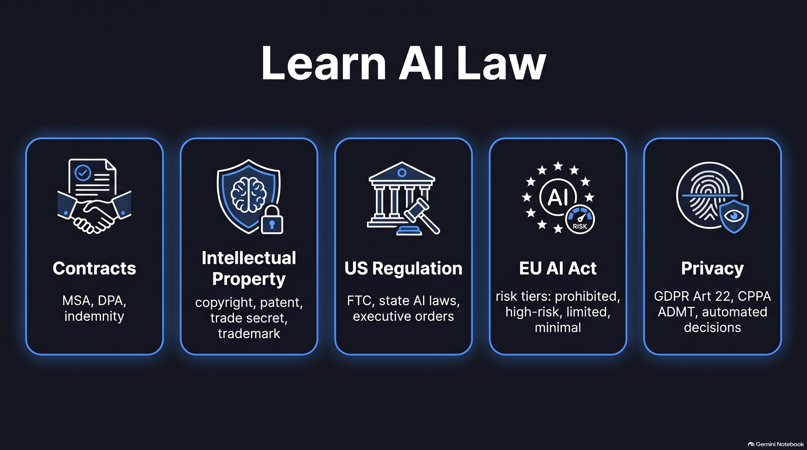

# Learn AI Law



A personal study console for a six-week program on AI contracts, intellectual property, regulation, and Responsible AI, written for enterprise architects. It runs in the browser on desktop and phone, installs to a home screen, and keeps your progress on your own device.

**Live:** https://aaronmeis.github.io/learn-ai-law/

**Not legal advice.** Study material only. Every exercise uses public exemplars: published terms, standard templates, statutes, opinions, and synthetic data. Primary sources take priority over this synthesis.

## What you can do

| Area | What's there |
| --- | --- |
| **Today** | Home screen. Daily goal (1 Short + 5 reviews), streak, the next Short to watch, cards due, progress by pillar, and the last 7 days. |
| **Learn** | Six-week curriculum, 51 vertical NotebookLM Shorts, week presenter decks, and study views for EU AI products, ISO/IEC 42001, 23894, and 22989, NIST Measure and TEVV, the Generative AI Profile (NIST AI 600-1), and the security RMF (SP 800-37). |
| **Practice** | Spaced-repetition flashcards (280 terms), quiz by week, practice checklist, and study prompts. |
| **Reference** | Standards map, 100/200/300 progress map, glossary, EA mapping (TOGAF, Zachman, DoDAF, NIST AI RMF), and external references. |

After each Short, **Check yourself** shows matching quiz questions and key terms from the glossary, with a button to drill those terms as flashcards.

**Keyboard:** Ctrl/⌘ K search everything · J/K next and previous Short · Q jump to the Short's questions · Space, arrows and 1–3 in flashcards.

**Phone:** bottom tab bar (Today, Shorts, Practice, Learn, More), a full-screen Shorts feed you swipe through, and flashcard swipes (→ Good, ← Again, ↑ Hard). Use your browser's **Add to Home Screen** to install it. Notes, cards, and quizzes then work offline. Videos need a connection.

**Your progress** is saved in the browser you use, per device. Use **Export progress** (sidebar, or More on a phone) to save a file, and **Import** it on another device.

## Files

| Path | Purpose |
| --- | --- |
| `index.html` | Page shell, grouped navigation, mobile tab bar, search dialog. |
| `css/base.css` | Themes (GitHub, Geist, Catppuccin; light and dark) and styles for the study views. |
| `css/enhance.css` | Today, Shorts, mobile layout, search, accessibility. |
| `js/data.js` | Study content: external references, glossary, weeks, ladder, quiz. Edit content here. |
| `js/app.js` | The study views (curriculum, flashcards, quiz, standards, decks...). |
| `js/enhance.js` | Routing (`#/today`, `#/shorts/<id>`), Today, Shorts player and feed, streaks, search, export and import. |
| `shorts-catalog.json` | Shorts list, written by the NotebookLM download scripts. |
| `shorts-meta.json` | Per Short: pillar, keywords for Check yourself, duration, poster, and `youtube` ID. Kept separate so the download scripts can rewrite the catalog without losing these fields. |
| `decks-catalog.json` | Week deck slides. |
| `media/shorts/`, `media/posters/`, `media/decks/` | Short MP4s, poster frames, deck slides and walkthrough videos. |
| `manifest.webmanifest`, `sw.js` | Home-screen install and offline cache. |
| `assets-src/`, `prompts/` | Source material (Gamma outlines, NotebookLM prompts, infographic briefs) and reusable study prompts. |
| `scripts/` | NotebookLM Shorts pipeline, `enrich_shorts_meta.py`, `check_youtube.py`. |

## Adding Shorts

1. Download them with the existing NotebookLM scripts, which update `shorts-catalog.json` and `media/shorts/`.
2. Run `python scripts/enrich_shorts_meta.py` to add the duration and a poster frame for each new Short (needs ffmpeg).
3. In `shorts-meta.json`, set each new Short's `pillar` (Foundations, Contracts, IP, Regulatory, or Responsible AI) and a few `keywords`. Check yourself uses the keywords to find matching quiz questions and glossary terms.

## Hosting Shorts on YouTube

The site plays a Short from YouTube when its entry in `shorts-meta.json` has a `youtube` ID, and from `media/shorts/` otherwise. If YouTube can't play a video (private, deleted, embedding off, or YouTube blocked on that network), the site falls back to the MP4 automatically.

1. Upload each MP4 in YouTube Studio with **Visibility: Unlisted**. Under **Show more**, make sure **Allow embedding** is checked.
2. Make a CSV with two columns, the Short id and its YouTube link:
   ```
   32-aibom-versus-sbom,https://youtube.com/shorts/AbCdEfGhIjK
   ```
3. Import the IDs and check them:
   ```
   python scripts/check_youtube.py --import youtube-ids.csv
   ```
   Each line prints `OK` or `FAIL` with the reason. Run `python scripts/check_youtube.py` any time to recheck.
4. Serve the site locally, open a Short, and confirm the player shows YouTube's controls.
5. Only when every Short passes, delete the MP4s from `media/shorts/`. The fallback needs them until then.

Unlisted videos are not private: anyone with the link can watch them.

## Running locally

Serve the folder. The Shorts and deck catalogs load with `fetch`, which doesn't work from a double-clicked file.

```
npx serve .
```

Then open the address it prints. On a phone on the same Wi-Fi, use the Network address it shows.

## Publishing

GitHub Pages publishes the `main` branch from the repo root. There's no build step: push to `main` and the site updates within a minute or two. If an installed copy looks out of date, reload once; pages and data load from the network first, with the offline copy used only when there's no connection.
